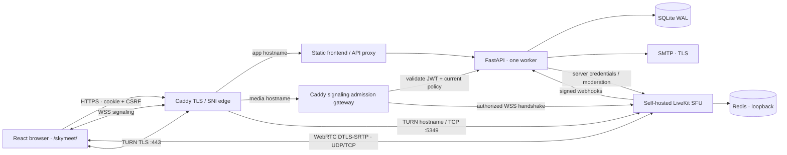

# Sky Meet architecture

FastAPI handles authorization and metadata only. Audio/video and ephemeral chat travel through LiveKit. SQLite never receives media. The current release is unrecorded and has no Egress service. TLS and WebRTC transport encryption are not end-to-end encryption; the company-controlled SFU can access media.

## Modules and data

- `backend/app/main.py`: API, server-side policies, attendance webhook, reconciliation/reminder worker.
- `security.py`: Argon2, opaque session/capability hashes, CSRF HMAC, bounded login/join token rate limits, Fernet invitation encryption.
- `media.py`: narrow 60-second participant JWTs, server-side moderation API.
- `mail.py`: branded multipart email, standards-compliant UTF-8 folded ICS.
- `models.py` + Alembic revisions: users, company settings, employee sessions, meetings, meeting credentials, invitations, personal/shared guest sessions, participants, audit events. Recording tables are deliberately absent while recording is disabled.
- `src/App.tsx`: employee and admin workspace, scheduling, invitation and user management.
- `src/MeetingLogin.tsx` and `src/Invitations.tsx`: protected shared link, copy controls and guest login.
- `src/Meeting.tsx`: legacy invitation exchange, SDK pre-join, grid/screen-share stage, chat, moderation, post-call view.
- `src/i18n.tsx`: English/Arabic product strings, document direction, local date formatting.

IDs are random UUIDs for addressing, never credentials. Every meeting gets a `guest-…` username and a 96-bit random password. Argon2 verifies the password; a Fernet-encrypted copy, keyed by server-only `APP_SECRET`, allows the host/admin to retrieve and share it. Public meeting metadata never returns credentials. Login is origin-checked and rate-limited; secrets travel in POST bodies, never URLs.

Successful shared login creates a 256-bit opaque HttpOnly SameSite session cookie. Only its hash is stored. Each browser gets a separate `s-…` participant identity; same-browser refresh preserves identity/admission. Sessions expire at the earlier of 12 hours or the meeting end plus 30 minutes. The gateway and reconciliation worker reject expired shared sessions. Guest sessions confer no staff role. Sharing the credentials shares access; these credentials do not establish a person's identity. A removed guest can use a new browser to request entry again, so keep the waiting room enabled for attendee verification.

Legacy personal invitation links now lead to the meeting login. The legacy exchange endpoint also requires meeting credentials for guests; explicitly invited signed-in employees retain their account-based path. The upgrade clears pre-password guest sessions and removes their admission states. Startup backfills existing meeting credentials; new meetings generate them in the creation transaction.

## Policies

Admission opens 15 minutes before the scheduled start. Times are validated as offset-aware, stored as UTC epoch seconds, and displayed in the viewer's browser timezone. Scheduling uses the browser's IANA timezone, shown on the form. Admins may assign another host during creation; host reassignment afterward is deliberately disallowed.

The host is admitted immediately. Invited employees and guests obey the waiting-room policy. An administrator can require waiting rooms globally; hosts cannot weaken that setting. Employees can access only their own meetings or meetings matching an active email invitation. Admins may manage any meeting. Admin and host moderation never comes from a client-supplied role.

Host disconnection does not end a meeting. Guests stay connected and the same host can return. SDK automatic reconnect runs first; after a final disconnection, users see a Rejoin action. Refresh requires the pre-join action again and retains admission through the same participant identity. A locked room rejects new token issuance, including a refreshed guest, until the host unlocks it. Existing connected participants can stay.

Meetings continue until the host ends them or 30 minutes after the scheduled end. The backend worker enforces the deadline every 15 seconds, and token issuance independently enforces it. Closing/cancelling is persisted before media deletion; deletion failures return an actionable 503 and are retried. Empty-room webhooks never end a meeting. Attendance follows signed webhooks; event IDs are deduplicated.

Chat is transient, not written to the database, and is lost on refresh. Host mute silences a current audio track; the participant can deliberately unmute again. Hosts cannot remotely enable a camera or microphone. Hand raises are stored with participant state.

## Operational boundaries

Run **one API worker and one API replica**: the rate limiter and periodic scheduler are process-local. For scale, move those to a shared Redis-backed worker/limiter before adding replicas. Redis in this deployment supports LiveKit, not a distributed application worker.

Self-hosted LiveKit does not invalidate previously issued participant JWTs on removal, and SDK refresh tokens can live longer than the initial 60-second token. Therefore, a separate Caddy signaling gateway checks the signed token and current meeting/participant/invitation/account policy before every `/rtc` connection. It rejects removed/revoked participants and closed meetings even if the JWT is still cryptographically valid. The raw SFU signaling port must be private; exposing it bypasses this protection. A lock permits transport reconnect of an already-connected admitted participant, while a fresh browser token request is blocked. There is still a narrow check-to-connect race; signed webhook validation and periodic cleanup provide defense in depth. Active media removal is performed by LiveKit's server API and depends on that service being reachable.

There is no SSO, MFA, public registration, password-reset email, recurring meeting series, password-free public guest access, Egress recording, transcription, persistent chat, PostgreSQL data migration tool, HA, or distributed rate limiter. Passwords can be reset by an administrator and existing sessions are invalidated. The backend API has English actionable errors; product navigation and meeting controls have Arabic translations. Some SDK device names/technical diagnostics remain browser-provided English.
